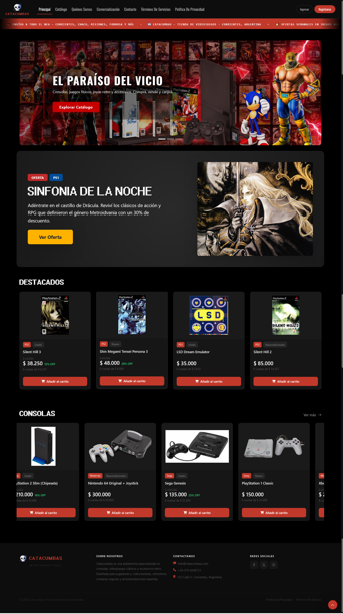

# 🎮 Catacumbas - Plataforma E-Commerce Retro

Un sistema de comercio electrónico desarrollado en Laravel para la venta de videojuegos clásicos y consolas. Proyecto para la cátedra Taller De Programación I.

---

## 🚀 Características Principales

Este proyecto es una aplicación web que permite gestionar las operaciones de una tienda virtual de videojuegos:

* Catálogo de Productos:
    * Visualización detallada de consolas y videojuegos retro disponibles.
    * Organización de la tienda mediante vistas dinámicas.

* Gestión de Datos:
    * Fase actual: Implementación utilizando arreglos asociativos en PHP para simular la persistencia y lectura de datos.
    * Fase futura: Arquitectura preparada para una inminente migración a una base de datos relacional real.

* Interfaz Dinámica:
    * Sistema de plantillas modulares creadas para una navegación fluida.

---

## 🛠️ Tecnologías Utilizadas

* Framework: Laravel
* Lenguaje Backend: PHP
* Motor de Plantillas: Blade
* Frontend: CSS y JavaScript
* Gestión de Datos: Arreglos asociativos en memoria (actualmente)

---

## 👨‍💻 Desarrolladores

* [Iturrieta Waldemar](https://github.com/raftontheshore)
* [Sanchez Rodriguez Enzo Nahuel](https://github.com/enzo2304)
